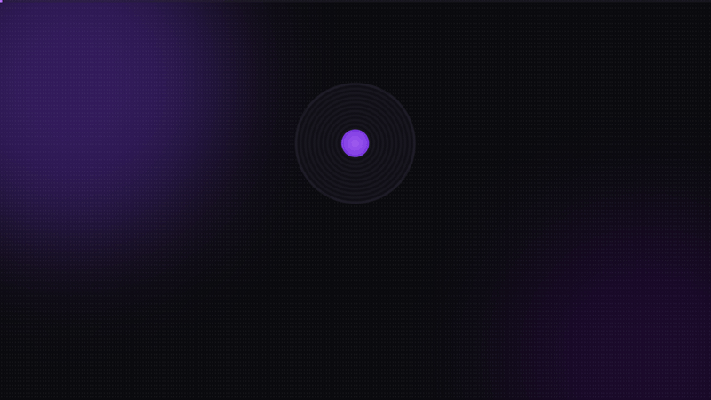
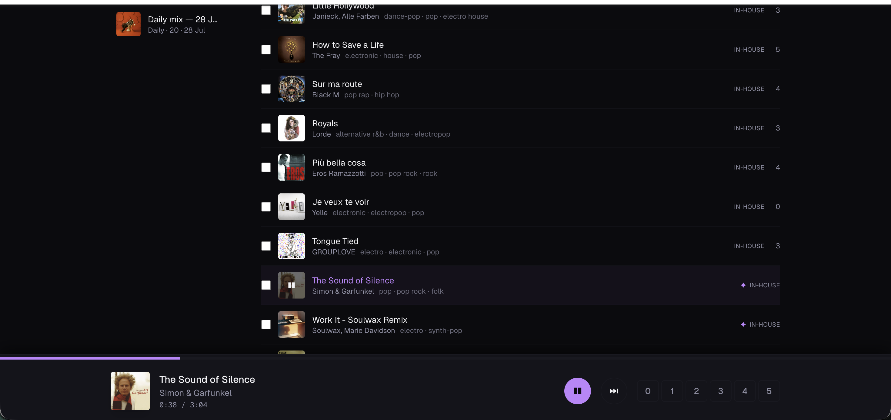
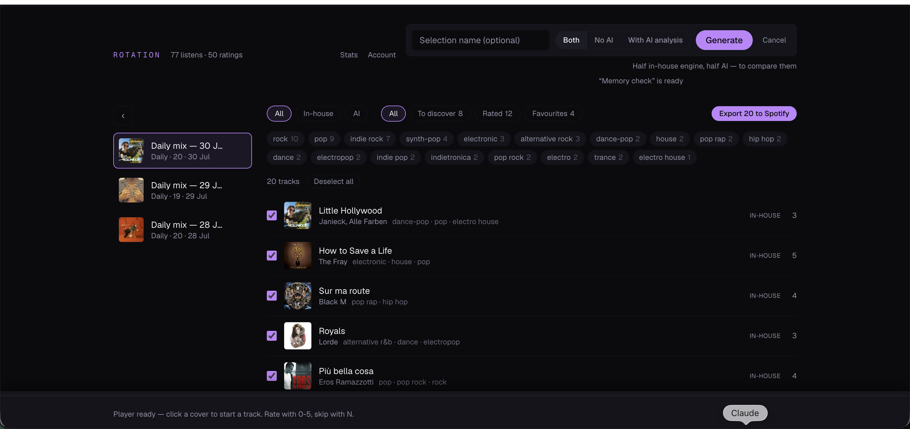
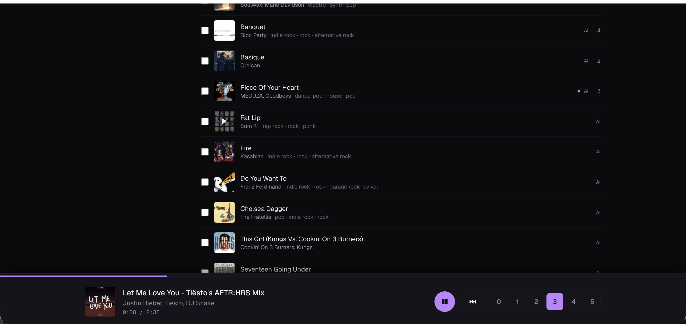
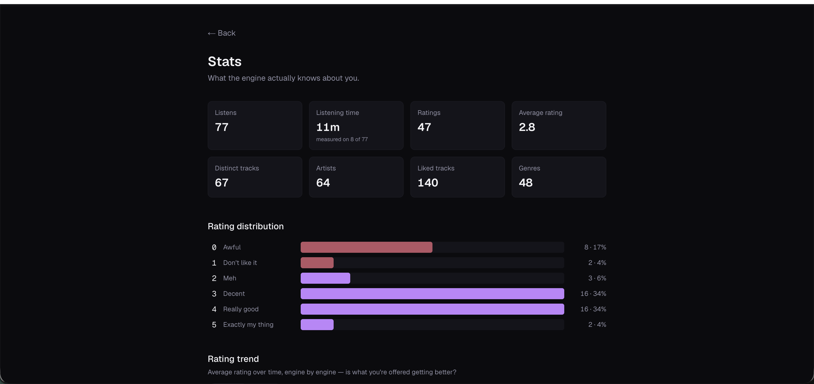
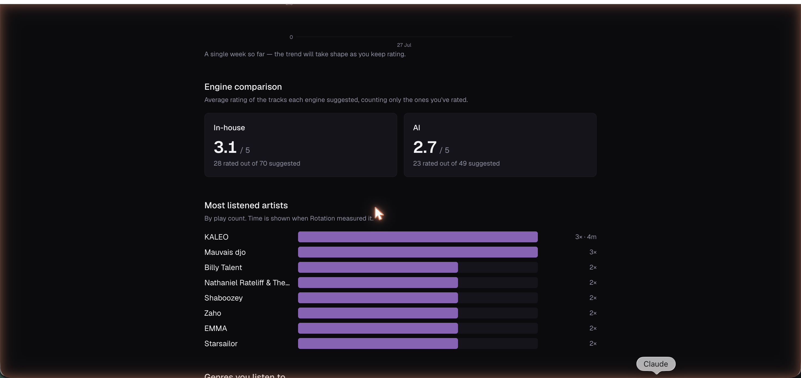
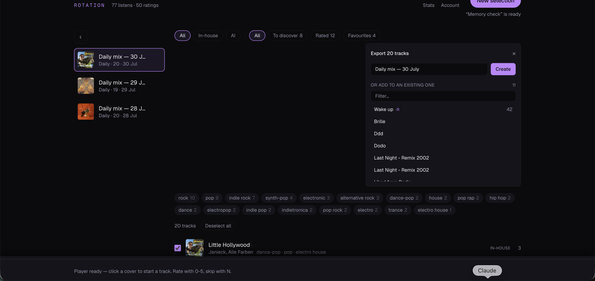

# NextTrack

[](https://github.com/arseneHuot/spotifyreco/actions/workflows/ci.yml)
[](LICENSE)
[](https://nextjs.org)
[](tsconfig.json)
[](https://supabase.com)
[](https://www.anthropic.com)
[](https://developer.spotify.com)

**Self-hosted music recommendations that don't go in circles.**

NextTrack connects to your Spotify account, logs what you actually listen to,
learns from your explicit 0–5 ratings, and builds fresh selections every day —
with two competing engines: a fully open, self-contained recommender, and
Claude (Anthropic's LLM) reasoning over a natural-language portrait of your
taste. You rate, they compete, the stats page tells you which one knows you
better.



*The 30-second pitch (in French). It's a plain HTML file — [open the live
version](docs/promo.html) and press Space to replay it.*

## Why

Spotify's own recommendations kept serving the same safe loop. NextTrack exists
to answer one question: *given everything I've listened to and everything I've
rated, what should I hear next that I haven't already worn out?* Every design
decision follows from it:

- **Ratings are first-class.** 0 means "never again", 5 means "exactly my
  thing". The engines learn as much from what you reject as from what you love.
- **No repeats.** Anything recommended in the last 10 days is banned from new
  selections — including re-releases of the same song under a different
  Spotify ID, and including tracks from selections you've deleted.
- **Discovery is enforced.** Part of every selection is reserved for
  exploration (a Thompson-sampling bandit decides which directions deserve it),
  even when your taste profile is sharply defined.
- **Everything is yours.** Your instance, your database, your keys. Delete the
  account and everything goes with it.

## What it looks like



| | |
|---|---|
|  |  |
| **New selection** — name it, pick an engine (in-house, AI, or half-and-half to compare them), and follow real progress even if you close the tab. | **AI picks** — each suggestion is verified against MusicBrainz *and* Spotify before it reaches you; hallucinated tracks are counted and discarded. |
|  |  |
| **Stats** — what the engine actually knows about you: rating distribution, listening time, genres. | **Engine A/B** — average rating of each engine's suggestions, only on tracks you've actually judged. |



**Export** — select tracks (or a whole filtered view) and push them to a new
Spotify playlist — named after the selection by default — or into one you
already maintain.

## How it works

```
        Spotify OAuth (via Supabase Auth)
                     │
   ┌─────────────────┼──────────────────────┐
   │ every 10 min    │ hourly               │ daily, 6:00
   ▼                 ▼                      ▼
 poll            enrichment              generation
 recently-       ReccoBeats (audio       ┌───────────────┐
 played +        features), MusicBrainz  │ taste profile │  time-decayed listens
 now-playing     (MBIDs, genres),        │  (Postgres    │  (90-day half-life),
 → listens       Last.fm (tags,          │   only)       │  ratings ×1.6,
                 similar artists),       └───────┬───────┘  likes, top tracks
                 ListenBrainz                    │
                 (similar recordings)     ┌──────┴──────────────┐
                                          ▼                     ▼
                                   in-house engine         AI engine
                                   tag/feature scoring,    natural-language
                                   MMR diversity rerank,   portrait → Claude →
                                   bandit exploration      MusicBrainz check →
                                          │                Spotify check
                                          └──────┬─────────┘
                                                 ▼
                                        named selection
                                        (no repeats < 10 days)
```

**The taste profile** is built entirely from Postgres — no network calls. It
weighs listens with a 90-day half-life (what you played last season still
counts for half; last year barely registers), gives explicit ratings the
strongest signal weight, and knows which tags you consistently reject.

**The in-house engine** scores catalogue candidates against the profile
(tags + audio features), reranks for diversity with MMR so you don't get five
tracks from one niche, and reserves part of each batch for exploration guided
by a Thompson-sampling bandit fed by your past reactions.

**The AI engine** describes your taste in plain language — most-played artists
ranked, most-replayed tracks, tracks rated 4–5 and 0–1, genre hierarchy
(core / present / marginal) — and asks Claude for real tracks with a specific
reason each. Then comes the part that makes it usable:

> **Anti-hallucination.** No suggestion is taken on faith. Each one must be
> found in MusicBrainz (an open database, independent of any commercial
> catalogue) **and then** on Spotify. Whatever fails is discarded and counted —
> the UI tells you exactly why an AI batch came up short ("3 not found on
> Spotify, 2 already in your library…").

**Compliance note.** Spotify's Developer Policy forbids feeding Spotify Content
to AI models. The portrait sent to Claude is built exclusively from open
sources (Last.fm/MusicBrainz tags, ReccoBeats features, MusicBrainz-resolved
artist names). Spotify only comes in afterwards, to make a named track
playable.

**Generations run as background jobs.** A generation takes 2–3 minutes with
the AI engine. The server returns immediately and the work continues,
publishing progress to the database — close the tab, come back, the progress
bar is still there. One generation at a time per user.

**Playback happens in the browser** through the Spotify Web Playback SDK
(Premium required): click a cover, rate from the sticky player with keys 0–5,
skip with N, and tracks auto-advance at the end. Listening time is measured
precisely for everything played inside NextTrack — the Spotify API never
provides it.

## Know before you start

These constraints come from Spotify and shaped the whole architecture
(verified against official docs, July 2026):

| Constraint | Consequence |
|---|---|
| **5 users max** in development mode, allow-listed one by one in the developer dashboard | No self-service onboarding. Extended quota is reserved for organisations with 250k+ MAU. |
| **The app owner must have Spotify Premium** | Without it, playback (and effectively the app) stops working. |
| `audio-features`, `recommendations`, `related-artists` endpoints **removed** | Audio features come from ReccoBeats; similarity from ListenBrainz and Last.fm. |
| Quota is counted **per developer app**, not per user | One heavy user throttles everyone; the rate limiter is global and deliberately gentle. |
| Refresh tokens **expire after 6 months** | Users must reconnect; the app warns 14 days ahead. |
| `recently-played` keeps only **50 plays** and never returns listening duration | Collection must run every 5–15 minutes; duration is sampled during in-app playback. |

## Setup

### 0. Prerequisites

- A [Supabase](https://supabase.com) project (free tier is fine)
- A [Spotify developer app](https://developer.spotify.com/dashboard) (owner
  account must be Premium)
- Node.js ≥ 20.9
- Optional: an [Anthropic API key](https://console.anthropic.com) for the AI
  engine, a [Last.fm API key](https://www.last.fm/api/account/create) for
  richer genre tags

### 1. Spotify app

On <https://developer.spotify.com/dashboard>, create an app and set **one**
redirect URI — Supabase's, not your app's (Supabase receives the OAuth
callback):

```
https://<your-project>.supabase.co/auth/v1/callback
```

Then add each user in **Settings → User Management** with the exact email of
their Spotify account. Without this, sign-in succeeds but every API call
returns 403.

### 2. Supabase

In **Authentication → Sign In / Providers → Spotify**: enable the provider and
paste the Client ID / Client Secret from step 1.

In **Authentication → URL Configuration**: add your app's origin(s) to
*Redirect URLs* — `http://127.0.0.1:3000/**` for local development, plus your
production domain later. *This list is the single most common source of broken
sign-ins.*

Apply the schema:

```bash
supabase link --project-ref <ref>
supabase db push
```

### 3. Environment

```bash
npm install
cp .env.example .env.local
```

[`.env.example`](.env.example) documents every variable: where to find it,
whether it's required, and what you lose without it. The short version:

| Variable | Required | Purpose |
|---|---|---|
| `NEXT_PUBLIC_SUPABASE_URL` | ✅ | Supabase → Project Settings → API |
| `NEXT_PUBLIC_SUPABASE_PUBLISHABLE_KEY` | ✅ | same page |
| `SUPABASE_SECRET_KEY` | ✅ | same page — server-only, bypasses RLS |
| `SPOTIFY_CLIENT_ID` / `SPOTIFY_CLIENT_SECRET` | ✅ | your Spotify app |
| `TOKEN_ENCRYPTION_KEY` | ✅ | encrypts Spotify refresh tokens at rest — generate with `node -e "console.log(require('crypto').randomBytes(32).toString('base64'))"` |
| `CRON_SECRET` | ✅ | protects the background-task routes |
| `NEXT_PUBLIC_SITE_URL` | ✅ | your app's public origin (OAuth return) |
| `ANTHROPIC_API_KEY` | optional | enables the AI engine (~$0.05–0.15 per batch) |
| `LASTFM_API_KEY` | optional | much richer genre tags |
| `MUSICBRAINZ_USER_AGENT` | ✅ | MusicBrainz requires an identifying UA with contact |
| `ENABLE_SCHEDULER` | — | `true` on Railway/containers, `false` on Vercel (see below) |

```bash
npm run dev
```

### 4. Deploy

Two hosts are documented, and the choice matters:

| | [Railway](docs/railway.md) *(recommended)* | [Vercel](docs/deploiement.md) |
|---|---|---|
| Model | long-lived server | functions, killed at 300 s |
| AI generation (2–3 min) | fits | needs careful budgeting |
| Background-task logs | readable | invisible for detached work |
| Periodic tasks | `ENABLE_SCHEDULER=true`, self-scheduled | `vercel.json` crons |

**Railway in five minutes:** *Deploy from GitHub repo* → generate a domain →
paste your `.env.local` into Variables (Raw Editor), changing only
`NEXT_PUBLIC_SITE_URL` (your Railway domain) and `ENABLE_SCHEDULER=true` →
add `https://<your-domain>/**` to Supabase's Redirect URLs. Details, pitfalls
and verification steps: [docs/railway.md](docs/railway.md).

Never set `ENABLE_SCHEDULER=true` on a host that already triggers the cron
routes externally — every task would run twice, and the Spotify quota is
per-app.

## Commands

```bash
npm run dev        # dev server
npm run build      # production build
npm test           # unit tests
npm run typecheck  # type checking
```

## Architecture

```
src/
  app/            App Router routes, Server Actions
  components/     UI (rating, sticky player, export, generation tracking)
  lib/
    crypto.ts     AES-256-GCM encryption for Spotify tokens
    env.ts        environment validation (app boots without optional keys)
    rate-limit.ts per-service rate limiters (Spotify's is global on purpose)
    scheduler.ts  self-hosted periodic tasks (poll / enrich / daily selection)
    spotify/      auth, API client, listens collection, playback, playlists
    enrich/       ReccoBeats, MusicBrainz, Last.fm, ListenBrainz
    reco/         taste profile, scoring, diversity, no-repeat memory,
                  AI engine, background jobs
    supabase/     browser / server / service-role clients
supabase/
  migrations/     versioned schema — RLS assertions replay on every push
docs/             deployment guides, scheduler notes, screenshots
```

### Security posture

- Spotify refresh tokens are encrypted (AES-256-GCM) with a key that never
  touches the database — a Postgres dump alone cannot read them.
- `spotify_accounts` has RLS enabled with **zero policies**: not even its
  owner can read it from the browser.
- Migration `0002_rls_assertions.sql` fails the deploy if any published table
  lacks RLS or any policy forgets to filter on `user_id`.
- Cron routes answer 404 — not 401 — to unauthenticated callers: they don't
  advertise their existence.

## License

MIT — see [LICENSE](LICENSE). Personal project, not affiliated with Spotify AB.
